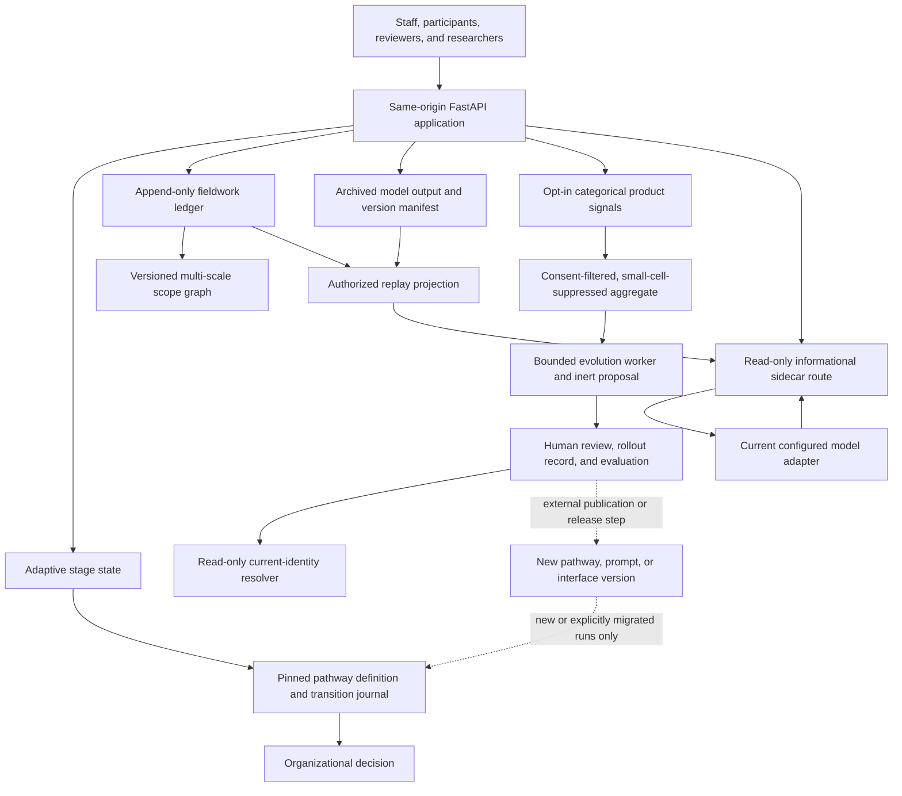

# Dynamic evolution and replay

This document defines what “dynamic,” “self-evolving,” and “replayable” mean for the toolkit. The software may propose and learn from new pathways, names, and interpretations. It cannot silently rewrite evidence, policy, or organizational decisions.

## Implementation status

| Capability | Status in this branch |
|---|---|
| Adaptive questions and interface states inside each review stage | Implemented |
| Immutable, versioned cross-stage pathway graph | Implemented |
| Confirmed facts, human approvals, and attributed transition journal | Implemented |
| Proceed, negotiate and return, pause/resume, non-AI, walk away, reassess, and retire routes | Implemented in the API and domain model |
| Cycle-aware guided-stage turns, state, completion, and retry keys | Implemented; earlier passes remain queryable and immutable |
| Append-only fieldwork cycles, events, provenance, and scope graphs | Implemented |
| Exact stored-output replay and deterministic, scale-aware projections | Implemented with transitive source-policy and current-consent enforcement |
| Historical and counterfactual branches that cannot alter canonical history | Implemented |
| Current-consent redaction, including for historical views | Implemented |
| Browser pathway decisions and a bounded fieldwork cycle/replay workspace | Implemented; advanced fieldwork operations remain API-only |
| Browser informational sidecar workspace | Implemented for the selected canonical cycle and scale; messages remain ephemeral |
| Browser product-signal consent, name preference, route, and replay controls | Implemented; inert while collection is disabled or consent is absent |
| Opt-in, categorical product-evolution signals with withdrawal | Implemented; disabled by default |
| Deterministic, de-identified aggregation with small-cell suppression | Implemented in the domain and store |
| Manual bounded proposal generation | Implemented as `python -m backend.evolve`; no automatic schedule |
| Bounded worker proposal types for pathways, prompts, interfaces, and names | Implemented in the domain and append-only store; the shipped command currently registers pathway, interface, and name rules |
| Human review, rollout/rollback records, and post-rollout evaluation | Implemented in the domain and append-only store; applying a release remains external |
| Governed self-naming proposal and public current-identity resolver | Implemented; only an explicit rollout activates a proposed name, and no rollout is seeded |
| Informational AI sidecar chat | Implemented as a read-only route in the main web service |
| Separate sidecar Railway service and automatic proposal schedule | Future hardening; not configured |

Here, “self-evolving” describes a bounded proposal process. The current product can collect explicitly opted-in categorical signals, build a consent-filtered aggregate, and produce an inert version proposal under reviewed rules. A human owner, reviewer, admin, or maintainer must review it. Rollout is a separate append-only action. Recording that action does not deploy code, change a Railway flag, or publish a pathway.

## Architecture



The adoption record remains the product boundary. A fieldwork project uses the adoption record id as its project id. Each new adoption record is also pinned to a pathway family, version, and SHA-256 definition checksum.

## Dynamic review behavior

The stage conversation is dynamic within a governed envelope:

- Each stage has named dimensions and required/optional coverage rather than a fixed answer count.
- Branch rules may activate or skip dimensions based on confirmed context.
- The server selects one of the supported interface states, such as free response, choice, classification, delegation, review routing, or editable draft.
- Literal unknown, not applicable, delegation, offline response, correction, and dissent remain distinct actions. They are not flattened into model guesses.
- Stage readiness comes from structured coverage. Completing a stage records the confirmed `stage_ready=true` fact but does not choose the next route.
- Guided turns, stage state, completions, and idempotency keys are scoped by pathway cycle. A negotiate-and-return or reassessment starts a fresh pass; pause/resume preserves the same pass.

The model drafts language and extracts proposed structure. The organization confirms facts, supplies approvals, and chooses the route.

## Versioned pathways

`backend/pathways.py` defines a closed pathway language. Conditions may use only `all`, `any`, `approval`, and fact tests with `eq`, `in`, `exists`, or `gte`. Arbitrary Python, expressions, and model-produced code cannot execute as pathway conditions.

The default version 2 pathway includes:

1. Strategic fit
2. Red line test
3. Stress test
4. Costs and benefits
5. Hidden curriculum
6. Accountability
7. Internal and external review
8. Decision record
9. Bounded pilot
10. Monitoring and reassessment

Non-AI redesign, walk away, and retirement are legitimate terminal states. Monitoring can return the work to internal and external review for another cycle.

Every Proceed edge requires all of:

- a currently confirmed `stage_ready=true` fact bound to the current node and cycle;
- a currently confirmed `stage_blocked=false` fact; and
- the owner approval gate for the current node, such as `redline_owner`.

A blocked guided state records readiness as false and cannot Proceed. It can still negotiate and return, pause, choose a non-AI route, or walk away where the graph permits. Negotiate-and-return and monitoring reassessment increment the cycle and append new false readiness for the destination pass. They never overwrite the previous pass. Pause and resume remain in the same cycle, and a run that is already active cannot append a synthetic resume decision.

Facts have `proposed`, `confirmed`, or `rejected` status. Proposed model facts never satisfy a route condition. Approvals have `approved`, `rejected`, or `changes_requested` status and are bound to a checksum of the confirmed facts considered at decision time. New facts and approvals supersede earlier rows by reference rather than modifying them.

Each transition stores the pinned pathway checksum, the exact confirmed-fact and approved-gate snapshot, the actor, rationale, timestamp, previous decision hash, and decision hash. Replaying that journal must reproduce the same node, status, cycle count, and hashes or the load fails closed.

Existing runs stay pinned to their original definition. Publishing a later version must not migrate active or historical runs in place. A separately approved migration or a new run may opt into a later version; a new cycle within an existing run keeps its pinned definition. Stored version 1 journals remain exactly replayable through a replay-only compatibility path, while new live version 1 evidence must satisfy the node- and cycle-bound readiness contract.

## Replayable ethnographic fieldwork

### Event envelope

Every fieldwork event stores:

- stable project, cycle, branch, and event ids;
- branch sequence and previous event hash;
- explicit actor id and actor role;
- observed, recorded, and committed timestamps;
- epistemic layer and event kind;
- canonical JSON payload;
- backward causal event references;
- versioned source references and optional source hashes;
- sensitivity, authorized scales, consent basis, consent subjects, authorization tags, and scope-node ids;
- schema, app, policy, consent, scope-graph, prompt, and model versions; and
- whether the event has canonical effect.

The chronology distinguishes when something happened, when it was written down, and when it entered the ledger. The database and domain model require `observed_at <= recorded_at <= committed_at`.

For application requests, actor ids come from the authenticated account and actor roles are resolved from that account's organization membership only after record access succeeds. Request bodies cannot supply or override either value. Replay therefore distinguishes `organization_owner`, `organization_reviewer`, and `organization_member` evidence instead of collapsing them into a generic authenticated role.

Canonical history is append-only. PostgreSQL triggers reject updates and deletes to fieldwork evidence, branches, cycles, scope versions, and projects. The in-process store applies the same rule for SQLite and tests. Loading a project reconstitutes the ledger and verifies event hashes, branch chains, causal ordering, and branch isolation.

### Reflexive and epistemic layers

The ledger keeps different kinds of knowing separate:

- `observation`: what was observed;
- `participant_account`: what a participant said or contributed;
- `researcher_record`: fieldwork administration and source record;
- `reflexive_memo`: how the research process may be shaping the account;
- `positionality`: the researcher’s relationship, authority, and standpoint;
- `member_check`: participant response to an interpretation;
- `interpretation`: a claim linked back to evidence;
- `synthesis`: a produced account or model output;
- `decision`: an attributed organizational decision;
- `intervention`: an action taken in the field;
- `after_effect`: what followed an intervention; and
- `counterfactual`: an explicitly noncanonical alternative.

Interpretations, member checks, decisions, interventions, and after-effects require causal event ids at the HTTP boundary. Participant accounts and member checks require a consent subject and a `granted` or `pending` consent basis. Pending evidence is redacted from projections.

### Multiple scales without flattening

A versioned scope graph is a directed acyclic graph. Nodes may represent encounters, cases, participants, teams, sites, programs, organizations, cohorts, networks, ecosystems, or a public context. Edges name situated relations without assuming that one scale automatically discloses another.

Every event separately declares:

1. the scope nodes it concerns; and
2. the access scales at which it may be projected.

The authorization context must independently grant the requested project, cycle, branch, scale, sensitivity, epistemic layer, authorization tags, and scope nodes. A client cannot gain access by merely requesting a broader scale.

The application currently grants organization members local scales from individual through organization with role-dependent sensitivity limits. Scope topology is not itself an access grant: organization owners and exact `reviewer` memberships receive record-wide scope-node authority for the current cycle, while ordinary members receive no scope-node ids until a trusted per-principal assignment model exists. Scoped events are therefore redacted from ordinary-member replay and scoped writes fail closed. The application does not grant cohort, network, ecosystem, or public projection. Cross-organization analysis needs a later governance model, explicit data-sharing agreements, and a separate authorization implementation.

### Consent and withdrawal

Consent is also an event stream. A grant or withdrawal does not edit an earlier participant account. Projection always resolves current canonical consent first. If consent has been withdrawn, consent-bound evidence is redacted even when replaying a historical branch or an earlier `as_of_event_id`.

Consent mutation authority is derived from trusted server policy, not from request fields. Clients supply a subject id, reason, chronology, and idempotency key, but cannot lower the event sensitivity, broaden or narrow its disclosure scale, choose an actor role, or grant themselves on-behalf-of authority. In the current application, organization owners and invited reviewers may record consent decisions for a separately identified subject. Ordinary members cannot. The router supports a verified participant-to-subject binding whose holder can grant or withdraw only for that subject, but the current account schema does not yet create such bindings and therefore fails closed for ordinary accounts.

This prevents “time travel” from bypassing a later withdrawal. It does not by itself satisfy a legal deletion request because the append-only source row and backups still exist. Retention, erasure, subject-key destruction, and research-ethics policy require a separate approved procedure before sensitive fieldwork goes live.

## Replay modes

| Mode | What is reproduced | Current support |
|---|---|---|
| Pathway replay | The exact definition, evidence snapshots, transition order, decisions, and hashes | Implemented |
| Projection replay | A deterministic authorized state from stored events at a scale and optional event boundary | Implemented through `GET .../replay` |
| Exact output replay | The exact stored content, content hash, generator label, and input event ids | Implemented through `GET .../outputs/{output_id}` |
| Historical branch | Parent history through a selected base event plus new noncanonical events | Implemented |
| Counterfactual branch | Parent history through a selected base event plus explicitly counterfactual events | Implemented |
| Model regeneration | A new output from authorized stored inputs using a declared generator version | Domain support exists; no HTTP model runner is exposed |

Exact replay and regeneration must remain separate. A nondeterministic model call cannot be reproduced merely by reusing a prompt. For every model-produced artifact worth revisiting, archive the returned content first with:

- input event ids;
- the output content and hash;
- model and generator version;
- prompt, policy, schema, consent, and app versions;
- source versions and hashes where available; and
- model settings and provider request id once those fields are added.

A later regeneration is a new labeled artifact with its own hash. It must never overwrite or masquerade as the stored output. The current version manifest does not yet capture every provider parameter, tool result, sampling seed, or request id, so byte-identical model execution is not claimed.

A stored output is a derived artifact, not a consent escape hatch. Its inputs must be nonempty, unique, backward references inside the selected branch's effective history. Nested outputs are resolved recursively. At write time, the output must inherit at least the maximum input sensitivity; the intersection of input access scales; and the union of input authorization tags, scope nodes, and consent subjects. A pending input keeps the output pending, and a granted input keeps it consent-bound. Pending, withdrawn, unauthorized-cycle, or otherwise unreadable inputs cannot produce a new output.

Projection, exact replay, and regeneration repeat this dependency check under current policy. If any direct or nested input becomes redacted because of withdrawal, scale, sensitivity, tag, scope, epistemic layer, or cycle authorization, the derived output is redacted or denied too. This check also protects legacy outputs whose stored manifest was weaker than its inputs. An authorized historical or counterfactual fork may derive from evidence inside its inherited cutoff, but the output remains noncanonical and cannot cite an event outside that effective history.

## Replay across cycles and pathways

A cycle is one bounded period of observation, interpretation, decision, intervention, and after-effect. Cycles may correspond to an initial field visit, a pilot, a participant review round, a policy change, or a later reassessment.

To compare cycles without collapsing them:

1. Keep each cycle’s canonical events and scope-graph versions intact.
2. Project each cycle at the same explicitly authorized scale.
3. Compare projection state hashes and named evidence changes.
4. Link later interpretations to earlier event ids where causal continuity is claimed.
5. Record changed positionality, consent, policy, model, and pathway versions.
6. Use a historical or counterfactual branch for alternate readings.
7. Commit an organizational decision only on the canonical branch.

The pathway journal and fieldwork ledger are related but intentionally distinct. A pathway transition says what route the organization chose. Fieldwork events preserve how observations, interpretations, member checks, interventions, and after-effects informed that choice. `source_event_ids` on pathway facts can bridge the two.

The guided review's `cycle_number` is also distinct from a fieldwork `cycle_id`. The former prevents a return through the pathway from colliding with prior stage turns, state, completion, or retry keys. The latter identifies a bounded ethnographic period with its own event stream and scope graph. An application workflow may link them in evidence and version metadata, but it must not infer that one number silently identifies the other.

## Governed product evolution

The safe evolution loop is:

```text
observe -> archive -> interpret -> propose -> human review -> publish a version
       -> target a bounded cohort -> monitor -> promote, revise, pause, or retire
```

The core loop is now implemented through `backend/evolution.py`, `backend/evolution_store.py`, the `backend/evolve.py` maintenance command, and migrations 006 and 008:

1. An authenticated user explicitly grants or withdraws product-signal consent.
2. The API accepts only an allowlisted signal, a bounded idempotency key, numeric/boolean measures, and server-registered categorical dimensions. Pydantic rejects extra content fields and arbitrary dimension tokens. The event id is deterministically hashed from the pseudonymous consent scope, signal, and idempotency key, so a retry does not append a duplicate.
3. The store hashes each event into one append-only global sequence. Each account has a server-generated random consent-scope id that is persisted once, hidden from account responses, and independent of `AUTH_PEPPER`. Consent decisions and events use only that pseudonym, so an auth-secret rotation cannot detach a withdrawal from earlier events. Migration 008 backfills existing accounts and carries forward any already-used branch-build scope when one exists.
4. An authorized projection filters by current consent, cohort, purpose, sensitivity, and time window.
5. Counts below the configured minimum cell size are suppressed. Each eligible signal gets its own evidence root, window, counts, and checksum; a suppressed signal exposes none of those fields. The aggregate also carries a deterministic checksum for the complete authorized projection.
6. `python -m backend.evolve` constructs the authorized projection and gives only that de-identified projection to `EvolutionWorker`. The command requires product telemetry to be explicitly enabled and applies the configured cohort and minimum-cell threshold.
7. The shipped rule registry can deterministically propose an interface clarification, the “Fieldwork Loop” display name, or a pathway review after at least three distinct consent scopes produce the corresponding signal and the configured minimum-cell threshold is met. The domain also supports prompt proposals. This command does not yet register a prompt rule.
8. A qualifying rule produces a deterministic, inert proposal with semantic versions, signal-scoped evidence checksums, a bounded cohort rollout, evaluation and guardrail metrics, and a rollback target. An unrelated signal cannot rotate that proposal's identity. The store reuses an unreviewed or approved proposal for the same component and target; it reconsiders a rejected target only after that rule's eligible evidence changes.
9. Before any append, the store reconstructs the canonical proposal, verifies its searchable provenance, requires an exact `component@version` rollout and rollback target, and permits `product.identity` only for a `name` proposal. It rejects a review dated before proposal creation. Invalid proposal or review attempts therefore add no immutable row and cannot poison the identity resolver. The store requires one immutable review by an authorized human role. Approval still does not apply the proposal.
10. Rollout or rollback is recorded as a separate human action. A rollout writer must be configured with a trusted semantic baseline for its component. Under a component-wide transaction lock, it validates the complete checksum chain, approval chronology, current active version, rollback stack, restore target, and append chronology before adding an immutable action. A pre-approval, stale, non-active, or backdated action adds no row. Evaluation is another append-only fact tied to the rollout and evidence-projection checksum. The next proposal derives its current semantic version from this validated rollout/rollback history. For a name proposal only, the read-only identity resolver reflects an explicit rollout and restores the previous or default identity after rollback.

PostgreSQL and SQLAlchemy guards reject update and delete operations across product signals, signal-consent decisions, proposals, reviews, rollout actions, and evaluations.

This pipeline supplies governance records and has no deployment authority. It does not alter the pathway registry, prompt files, browser assets, or Railway configuration. An explicit name rollout can change the value returned by the current-identity resolver. Approval alone has no effect. Applying any other proposal still requires the ordinary implementation and release process.

The public API exposes the read-only current identity plus consent and bounded signal collection. Proposal generation is available only through the maintenance command; review, rollout, and evaluation remain operator/domain-store workflows rather than public user endpoints.

The command prints restricted JSON containing aggregate and projection checksums and counts plus each proposal’s id, type, and checksum. It does not print consent scopes, actor identifiers, raw metrics, dimensions, messages, or fieldwork content. It has no code path for review, rollout, evaluation, Railway, or deployment actions.

### Self-naming

The implemented worker can create a `name` proposal with a short suggested display name, up to five aliases, a bounded rationale, current and proposed semantic versions, aggregate evidence, cohort ceiling, evaluation metric, guardrail metric, and rollback target. The shipped maintenance rule suggests “Fieldwork Loop” when its aggregate threshold is met. Neither the rule nor a generated proposal makes that the approved product name.

A name proposal is inert. Staff and affected participants still need to review the evidence and implications. An authorized human may approve or reject it. Approval alone leaves the identity unchanged. Only a separately recorded rollout makes `GET /api/product-evolution/identity` resolve that proposed display identity. Rollback restores the prior active identity or the default. No name rollout is seeded or performed by this branch, so the resolver returns “Nonprofit AI toolkit” version `0.8.0` from the default state.

The identity response includes the display name, aliases, semantic version, proposal checksum, ordered action checksums, and a `default` or `approved_rollout` source. It validates the proposal, review, action, target, checksum, and semantic-version chain and fails closed on corrupt history. At boot, the browser reads this endpoint and updates the document title and elements marked as product-name labels. The checked-in default remains visible until an approved explicit rollout exists.

Future application of an approved name should retain old display names as versioned aliases in historical replay. Stable database keys, API routes, event names, pathway checksums, and machine identifiers must never be renamed by the worker.

## Informational AI sidecar boundary

The sidecar is implemented at `POST /api/records/{record_id}/sidecar/chat` inside the existing FastAPI service. It receives a selected cycle, branch, and scale, then builds the same membership- and consent-aware fieldwork projection used by replay. The model receives only a detached snapshot of that projection, a system contract, bounded message history, and a SHA-256 context hash. The broader adoption working record is excluded because it does not carry field-level scale authorization.

It may:

- read projections authorized for the signed-in organization member;
- answer source-bounded informational questions;
- explain the current cycle and working record;
- identify missing evidence, disagreements, and possible follow-up questions; and
- point staff to the source event ids behind each claim.

It may not:

- read redacted content or infer withdrawn content from hashes or logs;
- mark facts confirmed;
- approve gates or transitions;
- append to a canonical fieldwork branch;
- publish pathway, prompt, policy, consent, or identity versions;
- change feature flags; or
- send participant data to an unapproved external model.

The router receives no store or audit writer. Its response explicitly reports `canonical_effect=false`, `record_write_authority=false`, `persisted=false`, and `exact_replay=false`. Claimed citations are filtered to event and source ids found in the authorized snapshot. A model failure returns a bounded error rather than writing fallback text into the record.

The synchronous model adapter is isolated by a process-local, nonblocking capacity gate. At most four sidecar model calls are admitted by default; excess calls return `503` with `Retry-After: 1` instead of waiting in FastAPI's shared worker pool. This protects unrelated synchronous endpoints from a slow or unavailable model. A future multi-process or separate-service deployment still needs a distributed capacity policy.

The current app does not persist the sidecar prompt, answer, or optional categorical callback telemetry. The answer is therefore not exactly replayable. If an answer is worth keeping, a human must create an attributed canonical entry or stored output through the fieldwork API. Running this router as a separate private Railway service with its own identity remains a future defense-in-depth option, not the current topology.

## HTTP contract

All endpoints are record-scoped and require the existing authenticated session. State-changing requests also require the exact `Origin`, session cookies, and `X-CSRF-Token`.

### Pathways

| Method and route | Purpose |
|---|---|
| `POST /api/records/{record_id}/pathway` | Ensure a run exists with author, reviewer, or monitor entry role |
| `GET /api/records/{record_id}/pathway` | Read pinned definition, current state, evidence, available routes, and journal |
| `POST /api/records/{record_id}/pathway/facts` | Append a proposed, confirmed, or rejected fact |
| `POST /api/records/{record_id}/pathway/approvals` | Append owner/reviewer approval, rejection, or requested changes |
| `POST /api/records/{record_id}/pathway/checkpoints` | Confirm server-owned readiness for the current synthesis or pilot node and cycle |
| `POST /api/records/{record_id}/pathway/transitions` | Choose an eligible route with rationale and idempotency key |

`POST .../stages/{stage}/complete` now returns `route_required=true`, the current `cycle_number`, a confirmed node- and cycle-bound readiness fact, and current pathway state. The client must then record the required approval and transition. It must not assume the next stage from a static list. Re-entering a stage after negotiate-and-return or reassessment creates a fresh guided pass while retaining the earlier pass.

Synthesis and pilot do not use the guided-stage completion route. Their explicit confirmation dialog calls `/pathway/checkpoints` with the pinned node and cycle. The server accepts only `confirmed:true`, an owner or reviewer, an actual Proceed edge, and an idempotent bounded rationale; it then writes the reserved readiness facts. Approval remains a separate evidence-bound action. Monitoring has no Proceed edge in the current graph and therefore cannot manufacture one through this endpoint.

### Fieldwork

| Method and route | Purpose |
|---|---|
| `POST/GET /api/records/{record_id}/fieldwork/cycles` | Open or list cycles |
| `POST .../cycles/{cycle_id}/observations` | Append an observation |
| `POST .../participant-accounts` | Append a consent-bound participant account |
| `POST .../reflexive-memos` | Append a reflexive memo |
| `POST .../positionality-memos` | Append a positionality memo |
| `POST .../interpretations` | Append an evidence-linked interpretation |
| `POST .../member-checks` | Append a consent-bound member check |
| `POST .../decisions` | Append an evidence-linked decision |
| `POST .../interventions` | Append an evidence-linked intervention |
| `POST .../after-effects` | Append an evidence-linked after-effect |
| `POST .../scope-graphs` | Publish the next scope-graph version on a branch |
| `POST .../consent/grants` | Append a canonical consent grant |
| `POST .../consent/withdrawals` | Append a canonical consent withdrawal |
| `POST .../branches` | Fork a historical or counterfactual branch |
| `GET .../replay?scale=...` | Project an authorized branch, optionally as of an event |
| `POST .../outputs` | Archive an output and its input event ids |
| `GET .../outputs/{output_id}?scale=...` | Retrieve the exact stored output under current authorization |

The browser now exposes a bounded fieldwork workspace for opening cycles, appending observations, reflexive memos, and positionality memos, replaying the canonical timeline by local scale and event boundary, and asking the ephemeral sidecar about the selected canonical cycle and scale. Participant accounts, member checks, fieldwork-consent changes, scope graphs, forks, interpretations, decisions, interventions, after-effects, and stored-output creation remain API-only because they require more deliberate context.

### Informational sidecar

| Method and route | Purpose |
|---|---|
| `POST /api/records/{record_id}/sidecar/chat` | Answer from one authorized cycle/branch/scale snapshot without persistence or canonical authority |

The request contains `message`, up to 12 user/assistant history items, `scale`, `cycle_id`, and `branch_id`. It requires the authenticated record membership and CSRF contract. The response includes filtered citations, selection, context hash, model version, and explicit false write/replay flags.

### Product evolution

| Method and route | Purpose |
|---|---|
| `GET /api/product-evolution/identity` | Publicly resolve the default or explicitly rolled-out current display identity without exposing proposals or reviews |
| `GET /api/product-evolution/consent` | Report whether collection is enabled and the caller’s current opt-in state |
| `POST /api/product-evolution/consent` | Append an opt-in or withdrawal decision |
| `POST /api/product-evolution/signals` | Append one allowlisted categorical/numeric signal when collection and consent are active |

Allowlisted signals cover help requests, confusing routes, negotiate/non-AI/walk-away choices, replay use, and two name preferences. The body requires `signal` and an 8–120 character `idempotency_key`; it may additionally include only `helpful`, `elapsed_ms`, `pathway_stage`, `interface_state`, `route`, and `scale`. Free text and extra fields are rejected.

When collection is enabled, the browser exposes an explicit opt-in/withdrawal checkbox and two categorical name-preference buttons. After opt-in, it also emits a fresh idempotent signal for negotiate, non-AI, or walk-away route selection and successful fieldwork replay. It sends no signal while collection is disabled or current consent is absent.

## Local API walkthrough

Start the app, register and verify a local account through `/api/dev/outbox`, sign in, and create an adoption record as described in [BACKEND.md](../BACKEND.md). The examples below assume:

```bash
BASE=http://127.0.0.1:8765
COOKIE_JAR=/tmp/toolkit-cookies.txt
CSRF='<csrf_token from POST /api/auth/login>'
RECORD_ID='<record id>'
```

Every write uses the same headers:

```bash
-b "$COOKIE_JAR" -c "$COOKIE_JAR" \
  -H "Origin: $BASE" \
  -H "X-CSRF-Token: $CSRF" \
  -H 'Content-Type: application/json'
```

Open a fieldwork cycle:

```bash
NOW=$(date -u +'%Y-%m-%dT%H:%M:%SZ')
curl -sS -b "$COOKIE_JAR" -c "$COOKIE_JAR" \
  -H "Origin: $BASE" -H "X-CSRF-Token: $CSRF" \
  -H 'Content-Type: application/json' \
  -d "{\"label\":\"Beta round 1\",\"observed_at\":\"$NOW\",\"recorded_at\":\"$NOW\"}" \
  "$BASE/api/records/$RECORD_ID/fieldwork/cycles"
```

Save the returned `cycle_id`, then append an observation:

```bash
CYCLE_ID='<cycle id>'
NOW=$(date -u +'%Y-%m-%dT%H:%M:%SZ')
curl -sS -b "$COOKIE_JAR" -c "$COOKIE_JAR" \
  -H "Origin: $BASE" -H "X-CSRF-Token: $CSRF" \
  -H 'Content-Type: application/json' \
  -d "{\"content\":\"A reviewer paused at the ownership question.\",\"observed_at\":\"$NOW\",\"recorded_at\":\"$NOW\",\"sensitivity\":\"internal\",\"allowed_scales\":[\"organization\"],\"idempotency_key\":\"beta1-observation-0001\"}" \
  "$BASE/api/records/$RECORD_ID/fieldwork/cycles/$CYCLE_ID/observations"
```

Replay the canonical cycle at organization scale:

```bash
curl -sS -b "$COOKIE_JAR" \
  "$BASE/api/records/$RECORD_ID/fieldwork/cycles/$CYCLE_ID/replay?scale=organization"
```

Ask the non-persisting informational sidecar about that authorized projection:

```bash
BRANCH_ID="$RECORD_ID:canonical"
curl -sS -b "$COOKIE_JAR" -c "$COOKIE_JAR" \
  -H "Origin: $BASE" -H "X-CSRF-Token: $CSRF" \
  -H 'Content-Type: application/json' \
  -d "{\"message\":\"What remains uncertain in this cycle?\",\"history\":[],\"scale\":\"organization\",\"cycle_id\":\"$CYCLE_ID\",\"branch_id\":\"$BRANCH_ID\"}" \
  "$BASE/api/records/$RECORD_ID/sidecar/chat"
```

Read the current public display identity and its rollout provenance:

```bash
curl -sS "$BASE/api/product-evolution/identity"
```

For local product-signal testing, start the server with `PRODUCT_TELEMETRY_ENABLED=true`. Collection still requires a per-user opt-in:

```bash
curl -sS -b "$COOKIE_JAR" -c "$COOKIE_JAR" \
  -H "Origin: $BASE" -H "X-CSRF-Token: $CSRF" \
  -H 'Content-Type: application/json' \
  -d '{"enabled":true}' \
  "$BASE/api/product-evolution/consent"

curl -sS -b "$COOKIE_JAR" -c "$COOKIE_JAR" \
  -H "Origin: $BASE" -H "X-CSRF-Token: $CSRF" \
  -H 'Content-Type: application/json' \
  -d '{"signal":"interface.route_confusing","idempotency_key":"local-route-confusion-0001","helpful":false,"pathway_stage":"redline","interface_state":"review_stage"}' \
  "$BASE/api/product-evolution/signals"
```

Withdraw with the same consent endpoint and `{"enabled":false}`. The signal row remains append-only. Current-consent aggregation excludes it.

An operator can generate inert proposals after at least three distinct, currently consented scopes in the configured cohort submit one of the shipped rule signals and the configured minimum-cell threshold is met:

```bash
PRODUCT_TELEMETRY_ENABLED=true \
TELEMETRY_COHORT=beta \
TELEMETRY_MIN_CELL_SIZE=3 \
python -m backend.evolve
```

The command uses the same configured database as the application. Its JSON output is safe for an operator log only under the documented policy; it contains checksums and counts, not raw events. Running it does not review, apply, rename, publish, roll out, or deploy anything.

After completing a guided stage, inspect the pathway, approve the current owner gate, and proceed. Guided-stage readiness is already server-owned and recorded by completion; the generic fact endpoint rejects attempts to write its reserved keys:

```bash
curl -sS -b "$COOKIE_JAR" "$BASE/api/records/$RECORD_ID/pathway"

curl -sS -b "$COOKIE_JAR" -c "$COOKIE_JAR" \
  -H "Origin: $BASE" -H "X-CSRF-Token: $CSRF" \
  -H 'Content-Type: application/json' \
  -d '{"gate_key":"entry_owner","status":"approved","rationale":"The owner reviewed the current confirmed facts."}' \
  "$BASE/api/records/$RECORD_ID/pathway/approvals"

curl -sS -b "$COOKIE_JAR" -c "$COOKIE_JAR" \
  -H "Origin: $BASE" -H "X-CSRF-Token: $CSRF" \
  -H 'Content-Type: application/json' \
  -d '{"outcome":"proceed","rationale":"Proceed to the red line test under the recorded ownership conditions.","idempotency_key":"entry-proceed-0001"}' \
  "$BASE/api/records/$RECORD_ID/pathway/transitions"
```

At synthesis or pilot, replace guided completion with the dedicated checkpoint before recording that node's approval:

```bash
curl -sS -b "$COOKIE_JAR" -c "$COOKIE_JAR" \
  -H "Origin: $BASE" -H "X-CSRF-Token: $CSRF" \
  -H 'Content-Type: application/json' \
  -d '{"node":"synthesis","cycle_number":1,"confirmed":true,"rationale":"The decision record is ready for a bounded pilot.","idempotency_key":"synthesis-checkpoint-0001"}' \
  "$BASE/api/records/$RECORD_ID/pathway/checkpoints"
```

Use the cycle returned by `GET .../pathway`; do not assume it is 1 after a negotiate-and-return or reassessment.

## Invariants for future work

- Model output remains a proposal until a person confirms or approves it.
- Non-AI, pause, negotiate, walk away, and retire remain valid outcomes.
- A new version never changes the meaning of an old replay.
- Current consent governs every projection, including historical views.
- Cross-scale visibility is explicit and fail-closed.
- Participant accounts, interpretations, and model outputs stay distinguishable.
- The sidecar has no canonical write or approval authority.
- Display names may evolve; stable machine identities may not.
- Product telemetry does not become research evidence without consent, provenance, and an attributed canonical event.
