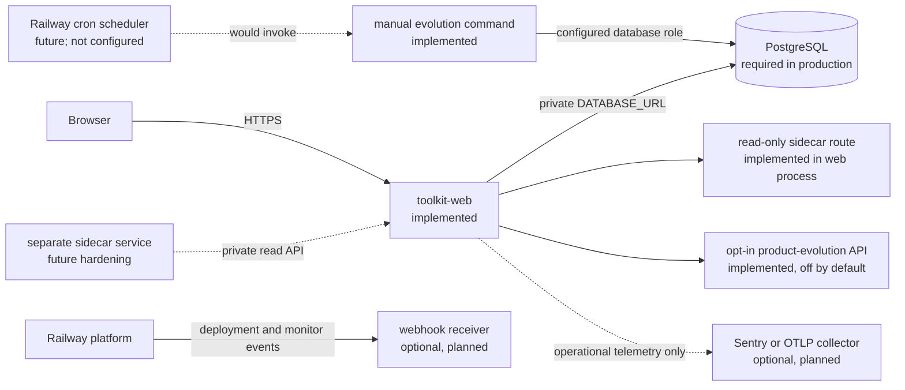

# Railway beta operations

This runbook turns the dynamic pathway and fieldwork architecture into a staged Railway operating model. It distinguishes checked-in behavior from proposed infrastructure. No Railway project, service, variable, flag, database, or deployment is changed by this branch.

## Current deployment contract

The repository currently defines one web-service deployment in `railway.json`:

- Railpack builds the image.
- `python -m backend.migrate` runs before the application deployment.
- Uvicorn listens on Railway’s injected `$PORT`.
- `/health` must return HTTP 200 before Railway activates the deployment.
- the process restarts on failure, up to ten retries.

The pre-deploy migration runner creates the base application schema, then leaves extension tables to the checked-in PostgreSQL files and applies each file once in filename order using `schema_migrations`. This preserves the PostgreSQL-specific constraints and triggers instead of letting the portable ORM schema preempt them. Migration `004_fieldwork_replay` adds the append-only fieldwork tables, triggers, and current-consent view. Migration `005_versioned_pathways` adds immutable pathway definitions, append-only facts, approvals, and transitions, plus the rebuildable run projection. Migration `006_governed_evolution` adds hash-chained product signals, signal-consent decisions, inert proposals, human reviews, rollout/rollback actions, evaluations, and append-only triggers. Migration `007_guided_stage_cycles` backfills guided turns, state, and completions to cycle 1 and installs positive, cycle-aware uniqueness and lookup constraints so later pathway passes preserve earlier evidence.

CI applies this full PostgreSQL sequence twice, then verifies the recorded versions, append-only triggers, hash and consent checks, and guided-cycle constraints. This is a release gate, not proof that Railway production has run the migration.

This follows Railway’s [pre-deploy command](https://docs.railway.com/deployments/pre-deploy-command) lifecycle: the command runs after build and before the application, has environment variables and private networking, and blocks the deployment if it exits nonzero. It runs in a separate container without mounted volumes, so migrations must use PostgreSQL rather than local filesystem state.

Railway [healthchecks](https://docs.railway.com/deployments/healthchecks) gate the initial traffic switch. They do not provide continuous uptime monitoring. `/health` verifies database connectivity and reports account-email readiness. It does not yet test model-provider completion, replay integrity on a sample record, sidecar health, or delivery-provider reachability.

## Current and hardening topology

Keep all server-to-server traffic inside the same Railway project and environment. Railway [private networking](https://docs.railway.com/networking/private-networking) isolates each environment and provides internal DNS under `railway.internal`. The browser cannot reach private services, so it must continue to call the public same-origin FastAPI application.

### `toolkit-web`

Status: implemented.

Responsibilities:

- authentication, organization membership, CSRF, and record authorization;
- adaptive stage conversation;
- pathway facts, approvals, and transitions;
- fieldwork writes and consent-aware projections;
- exact stored-output retrieval;
- a non-persisting informational sidecar route;
- opt-in bounded product-signal consent and ingestion; and
- a public, read-only current-display-identity resolver; and
- the static browser application.

Only this service receives a public domain. Use PostgreSQL’s private `DATABASE_URL` reference. Do not expose the database through a public TCP proxy for routine application traffic.

### PostgreSQL

Status: required by current production configuration.

Responsibilities:

- account and adoption-record state;
- model runs and concept-map versions;
- immutable pathway evidence and decisions; and
- append-only fieldwork, scope, consent, and output events; and
- append-only product signals, signal-consent decisions, evolution proposals, reviews, rollout/rollback records, and evaluations.

The database is evidence-bearing infrastructure. Give the web service an application role, not a superuser credential where Railway configuration permits it. A future separately deployed sidecar must not receive this credential.

### `information-sidecar`

Status: implemented as a router in `toolkit-web`; no separate Railway service is configured.

`POST /api/records/{record_id}/sidecar/chat` runs a second, informational chat against one record, cycle, branch, and authorized scale. The router receives no persistence callback. It cannot confirm facts, approve gates, transition a pathway, append canonical fieldwork, publish a new version, or change a feature flag. The response is explicitly noncanonical, unpersisted, and not exactly replayable.

The current implementation shares the web process, session principal, and configured model adapter. Tests cover its application-layer boundary. They do not establish process or credential isolation. A later `information-sidecar` Railway service should call a narrow private projection endpoint with its own read-only service identity. Until that exists, do not describe the sidecar as separately isolated infrastructure.

Sidecar answers remain ephemeral. A human can later cite an answer while creating an attributed canonical event or stored output. Returned citations are filtered to authorized event and source ids, and the response includes the projection-derived context hash.

### Evolution maintenance command and future cron

Status: `python -m backend.evolve` is implemented; no Railway cron or separate scheduled service is configured.

The command reads a current-consent, purpose- and cohort-bounded, small-cell-suppressed aggregate and idempotently saves deterministic interface, display-name, or pathway proposals. It requires `PRODUCT_TELEMETRY_ENABLED=true`, uses `TELEMETRY_COHORT` and `TELEMETRY_MIN_CELL_SIZE`, and prints restricted JSON with aggregate/projection checksums and counts plus proposal ids, types, and checksums. It has no authority to review, roll out, evaluate, rename, apply, or deploy a proposal.

A future cron could invoke this maintenance command after its database identity, failure reporting, concurrency, and review cadence are approved. Other suitable future jobs include retention reports, backup verification reminders, integrity sampling, and consent-safe aggregate materialization. Do not use cron as the interaction-event collector. The web request that accepts an event should persist it transactionally.

Railway [cron jobs](https://docs.railway.com/cron-jobs) start a service’s command on a UTC crontab schedule. The process must finish and exit. Schedules cannot be more frequent than every five minutes, timing may vary by a few minutes, and Railway skips an invocation if the previous one is still running. Each job therefore needs an idempotency key, a bounded batch, a durable cursor, and a safe retry strategy.

## Environment model

Railway [environments](https://docs.railway.com/environments) isolate services, variables, deployment histories, and private networks. Use three levels:

| Environment | Data | Audience | Promotion rule |
|---|---|---|---|
| PR environment | synthetic fixtures only | developers and reviewers | automated checks plus manual API smoke test |
| staging | consented test accounts or synthetic copies | staff, research team, invited internal testers | all acceptance gates below |
| production | approved initial users and beta cohorts | authorized organizations | named release approval and rollback owner |

Configure PR environments from `staging`. This keeps temporary deployments from inheriting production data assumptions. Railway deletes a PR environment when its pull request closes. Logs and copied third-party telemetry have separate retention. Treat these environments as real infrastructure and keep participant data out of them. Railway documents both persistent and ephemeral [PR environment workflows](https://docs.railway.com/guides/preview-deployments-with-pr-environments).

Use independent PostgreSQL services or isolated databases per environment. Private networking does not cross environments, which is the desired boundary. Never point staging or a PR environment at production `DATABASE_URL`.

## Supported variables

The application currently reads these production variables:

- `APP_ENV=production`
- `DATABASE_URL`
- `PUBLIC_APP_URL`
- `AUTH_PEPPER` or `SESSION_SECRET`
- `MODEL_BACKEND=ollama`
- `OLLAMA_API_KEY`
- `TOOLKIT_MODEL`
- `EMAIL_BACKEND=resend`
- `RESEND_API_KEY`
- `MAIL_FROM` or `EMAIL_FROM`
- `PRODUCT_TELEMETRY_ENABLED`, false unless explicitly enabled
- `TELEMETRY_COHORT`, a short categorical token with default `beta`
- `TELEMETRY_MIN_CELL_SIZE`, clamped to 3 through 100 with default 3

It also accepts `APP_VERSION` for the fieldwork version manifest, falling back to Railway’s injected `RAILWAY_GIT_COMMIT_SHA`. Session, verification, reset, cookie, SQLite, and test settings are documented by `backend/config.py` and are primarily local or advanced controls.

`PRODUCT_TELEMETRY_ENABLED` is a static environment switch, not a Railway feature flag. Even when true, collection requires each authenticated user’s explicit current opt-in. `TELEMETRY_MIN_CELL_SIZE` governs operator-side aggregate projections; the public API does not expose those projections.

No separate-sidecar, telemetry-export, retention, cron, or Railway runtime-feature-flag variable is code-supported. Add variables only with the code that consumes and validates them.

## Feature flags

Status: planned. No Railway flag SDK or runtime adapter is present in the Python application.

Railway [feature flags](https://docs.railway.com/feature-flags) are typed, project-scoped values with defaults and optional targeting rules evaluated at read time. The feature is currently in Priority Boarding and its API may change. Do not represent a dashboard flag as active product behavior until a tested server-side adapter reads it and applies a fail-closed fallback.

Proposed flags:

| Flag | Type | Default | Initial target |
|---|---|---|---|
| `pathway-routing-v1` | boolean | `false` | staff records, then named beta organizations |
| `fieldwork-capture-v1` | boolean | `false` | researchers with an approved protocol |
| `fieldwork-replay-v1` | boolean | `false` | staff and consented beta testers |
| `information-sidecar-v1` | boolean | `false` | staff-only sandbox |
| `evolution-proposals-v1` | boolean | `false` | governance reviewers |
| `identity-proposals-v1` | boolean | `false` | governance reviewers and participant advisors |
| `cross-org-projection-v1` | boolean | `false` | no target until data-sharing governance exists |

Use a stable organization or record key for percentage rollout. Do not target on participant identity, protected characteristics, consent status, free text, or inferred risk. Log the resolved flag name, variant, rule reason, and registry version as operational release context without logging the targeting value.

A flag may expose or hide a capability. It must not change an existing event, pathway definition, consent decision, or stored replay. Turning a flag off stops new use; it does not erase already recorded evidence. Until a Railway flag adapter is implemented, use the code-supported telemetry environment switch only as static environment configuration and do not claim targeted rollout.

## Product telemetry and research evidence

Keep three streams distinct:

### Railway platform metrics

Railway [metrics](https://docs.railway.com/observability/metrics) cover CPU, memory, disk, and network, with deployment markers and up to 30 days of project data. They do not collect application latency, error rates, replay failures, completion rates, or research outcomes.

Use platform metrics to answer operational questions such as:

- Is memory growing after a release?
- Did a replay endpoint cause CPU saturation?
- Is network egress inconsistent with the sidecar boundary?
- Is the database volume approaching its alert threshold?

### Product telemetry

The implemented product-evolution API accepts only an allowlisted signal, a required bounded idempotency key, optional numeric/boolean measures, and server-registered categorical dimensions. The server hashes the pseudonymous consent scope, signal, and idempotency key into a deterministic event id so a retry is not a second event. Current signals cover help requests, route confusion, negotiate/non-AI/walk-away selection, replay use, and two name preferences. Free text, unknown fields, and arbitrary dimension tokens fail validation.

When collection is enabled, the browser provides an explicit opt-in/withdrawal control and categorical current-name versus “Fieldwork Loop” preference buttons. After opt-in it also sends bounded route and replay signals. Disabled collection or absent current consent keeps these controls inert and sends nothing.

Collection is doubly gated by `PRODUCT_TELEMETRY_ENABLED=true` and a current per-user opt-in. The consent scope is a server-generated random pseudonym stored once on the account; it is neither accepted from the request nor derived from `AUTH_PEPPER`, and it is never returned by account endpoints. Consent and event rows use the pseudonym instead of the raw user id. Withdrawal appends a new decision and removes earlier consent-bound events from later authorized aggregates without mutating the hash chain, including after an auth-secret rotation. Migration 008 backfills existing accounts before traffic starts.

The store builds deterministic aggregates only for an authorized purpose, cohort, sensitivity, and time window. It suppresses small cells, returns no raw rows to the worker, and gives each eligible signal its own bounded evidence root and checksum. Suppressed signals expose no counts, hash root, or window. Unrelated signals therefore cannot rotate an existing proposal's identity. The store reuses an unreviewed or approved proposal for the same component and target, and reconsiders a rejected target only when that rule's eligible evidence changes. The bounded worker can create inert pathway, prompt, interface, or name proposals, deriving the next semantic version from checksum-validated rollout/rollback state. A separate human review, rollout/rollback record, and evaluation are required. A rollout writer must be given the trusted baseline for every component it can activate; under a component-wide transaction lock it rejects pre-approval, stale-version, non-active rollback, invalid restore-target, and backdated actions before an append-only row exists. These records do not deploy code or apply pathway, prompt, or interface changes. An explicit name rollout affects the identity resolver as described below.

The public `GET /api/product-evolution/identity` resolver starts from “Nonprofit AI toolkit” version `0.8.0`. A proposal and approval leave it at that default. An explicit approved name rollout activates the suggested display identity, and rollback restores the prior rollout or default. The response contains the display name, aliases, semantic version, proposal checksum, ordered action checksums, and source. It validates the complete identity provenance chain and fails closed on corruption. The browser reads this resolver at boot. No rollout is configured or seeded in this branch.

Never place message text, participant accounts, source locators, organization names, output content, sidecar prompts or answers, or fieldwork event payloads in product signals, operational logs, or third-party telemetry. The schema rejects key names associated with raw or identifying content. Operational review must still verify every new categorical field.

### Ethnographic and beta evidence

An observation that a user hesitated, disagreed, changed a workflow, or experienced an after-effect is research evidence, not automatic clickstream telemetry. Record it through the fieldwork API only under the approved protocol, with actor attribution, chronology, scope, sensitivity, consent basis, and causal references.

Product telemetry may suggest a follow-up question. It may not silently become a participant account, interpretation, or evolution proposal.

## Third-party observability

Status: not configured in this branch.

Railway’s [third-party observability guide](https://docs.railway.com/guides/third-party-observability) supports vendor SDKs or OpenTelemetry. A vendor SDK is simpler; OTLP preserves backend choice. Railway does not provide a generic stdout log drain, so raw-log forwarding requires application instrumentation or a separate forwarder.

Before enabling Sentry, Datadog, New Relic, Honeycomb, Grafana, or another provider:

1. Complete a data-flow and retention review.
2. Disable request and response bodies.
3. Scrub cookies, authorization headers, URL fragments, email addresses, route ids, source ids, consent ids, and free text.
4. Tag releases with Railway’s injected service, environment, deployment, and replica variables.
5. Set sampling independently for errors, traces, and profiles.
6. Test that a deliberate fieldwork payload never appears in the provider.
7. Define deletion, access, breach, and vendor-offboarding procedures.

Operational traces can identify that an authorized projection returned redactions. They must not identify what was redacted.

## Railway webhooks

Status: not configured in this branch.

Railway [webhooks](https://docs.railway.com/observability/webhooks) report platform events such as deployment changes and CPU, RAM, or volume alerts. They are project-level and may cover all project environments. They are not product-event hooks and must not be the pathway or fieldwork ingestion bus.

If a receiver is added:

- route by the environment and service ids in the payload;
- deduplicate deliveries;
- validate the event type and expected resource ids;
- do not treat arrival order as canonical chronology;
- do not use webhook content to confirm a pathway fact;
- retain only the minimum operational fields; and
- test actual platform delivery because the dashboard’s test button can encounter browser CORS limits.

The receiver may open an operational incident or annotate a deployment timeline. A human must connect an incident to fieldwork or a governance decision through the normal attributed API.

## Staged beta operation

### Phase 0: staff replay lab

- Use synthetic organizations and participant references.
- Exercise every route, including negotiate, pause/resume, non-AI, walk away, reassess, and retire.
- Create at least two fieldwork cycles and both fork modes.
- Verify exact-output hashes and projection hashes before and after restart.
- Confirm a later withdrawal redacts earlier consent-bound evidence in every replay.
- Keep `PRODUCT_TELEMETRY_ENABLED=false`; exercise sidecar boundaries with synthetic records only.

### Phase 1: invited initial users

- Use a named, small cohort with explicit onboarding and feedback consent.
- If bounded signals are enabled, verify the implemented browser opt-in/withdrawal control and plain-language no-content notice before inviting users.
- Start fieldwork capture with staff observations and reflexive memos. Do not collect participant accounts until that consent workflow is separately approved.
- Review open questions weekly with a product owner and research lead.
- Require an owner or reviewer for every consequential route.
- Publish no automatically generated pathway or identity changes.

### Phase 2: organizational beta

- Do not claim targeted Railway flags until the runtime adapter exists. Use a separate staging environment or a named operational cohort.
- Add member checks and after-effects where the protocol supports them.
- Compare cycles at organization scale first.
- Require a governance review before any cross-organization aggregation.
- Trial the in-process sidecar on authorized projections with no canonical write authority, and review whether separate-service isolation is required before production.

### Phase 3: governed evolution

- Run `python -m backend.evolve` manually against the intended environment and inspect its restricted JSON output. Do not describe it as scheduled until a Railway cron service is actually configured.
- Confirm the configured cohort and minimum-cell threshold before every run; the worker receives only the authorized, small-cell-suppressed product projection.
- Review inert version and display-name proposals with their evidence and rollback targets.
- Run replay, compatibility, privacy, accessibility, and counterfactual tests.
- Collect staff and affected-participant review.
- Publish a new immutable version only after named human approval.
- Roll it out to new records or explicitly opted-in cycles before wider promotion.

At every phase, preserve a no-deployment and non-AI path. “More AI use” is not a success metric.

## Acceptance gates

A release cannot move to the next phase until all applicable gates pass.

### Evidence and replay

- Stored output returns the original content and hash after process and database restart.
- Stored output inherits every direct and nested input restriction; withdrawal or later authorization loss redacts projection and exact replay.
- The same ledger, authorization, scale, and event boundary produce the same projection hash.
- Pathway replay reproduces all transition hashes and current state.
- Existing runs remain pinned when another pathway definition is introduced.
- Historical and counterfactual writes cannot acquire canonical effect.

### Consent and authorization

- Withdrawal redacts consent-bound evidence in present and historical projections.
- A caller cannot expand access by requesting another scale, branch, cycle, sensitivity, or scope node.
- Scope topology never grants itself: ordinary members have no scoped-event access until a trusted per-principal assignment exists, while owner/reviewer scope authority comes from server-side membership.
- Fieldwork actor ids and organization roles are derived after record access and cannot be supplied by a request body.
- Consent actor role, sensitivity, scales, tags, scope, and on-behalf-of authority come from trusted server policy; ordinary unbound members cannot change another subject's consent.
- Cross-organization scales fail closed.
- Logs and telemetry contain no content or stable consent-subject identifiers.
- Product-signal collection fails when the environment switch is off or the current user has not opted in.
- Withdrawal removes prior consent-bound signals from later aggregates.
- Cells below `TELEMETRY_MIN_CELL_SIZE` do not expose counts or measures.
- Retrying the same signal idempotency key for the same caller and signal does not append a second product event.
- The retention and erasure policy has legal and research-ethics approval.

### Human governance

- A proposed model fact cannot unlock a route.
- Proceed requires current confirmed readiness and the current node’s approval.
- Non-AI, negotiate, pause, walk away, and retire are usable and reported as valid outcomes.
- Sidecar credentials cannot write canonical evidence or approvals.
- Sidecar overload fails fast under its dedicated per-process capacity gate and does not starve an unrelated synchronous endpoint.
- A pathway or name proposal cannot publish without named human approval.
- Human approval alone does not apply or deploy a proposal; rollout and evaluation are separate records.
- The identity resolver stays at the default after a proposal or approval, activates only after an explicit valid rollout, and restores the prior/default identity after rollback.
- Invalid component/type/target metadata and reviews dated before proposal creation append no evolution row.

### Reliability and release

- Unit and API contract suites pass on Python 3.12.
- The PostgreSQL migrations complete in staging and are idempotent on a second run.
- `/health` succeeds and Railway reaches a terminal successful deployment state.
- A browser smoke test covers login, a dynamic stage, route approval, transition, fieldwork capture, and replay.
- Operational dashboards and alerts use the correct environment.
- A rollback drill and database restore drill have named owners and recorded results.

### Research and accessibility

- Beta consent distinguishes product use, operational telemetry, and research participation.
- Participants can decline research capture without losing legitimate product access where feasible.
- Staff can inspect the provenance behind an interpretation or sidecar claim.
- Keyboard, focus, screen-reader labels, reduced motion, mobile geometry, and error recovery are verified for new browser controls.

## Rollback and recovery

Railway [rollback](https://docs.railway.com/deployments/deployment-actions) redeploys a previous successful image and restores that deployment’s custom variables. It does not reverse a database migration or erase data written by a newer application version.

Use this order:

1. Disable the affected runtime flag or sidecar route.
2. Stop new writes for the affected capability if integrity is uncertain.
3. Capture deployment, app-version, pathway-version, and latest decision hashes.
4. Roll back the web image to the last known good deployment.
5. Verify `/health`, authentication, record load, pathway replay, and a consent-aware projection.
6. Leave additive fieldwork, pathway, and evolution tables in place.
7. Restore data only for confirmed corruption, with a separate recovery decision and audit record.

Current migrations are additive and compatible with an older application that ignores the new tables. Future destructive migrations must use expand/contract releases across multiple deployments. They also require a tested backup and forward-repair plan.

Railway offers scheduled [volume backups](https://docs.railway.com/volumes/backups) and PostgreSQL [point-in-time recovery](https://docs.railway.com/volumes/point-in-time-recovery). Backup recovery is an infrastructure control, not a consent or application-retention mechanism. Restored backups may contain evidence that current policy redacts, so the application must reapply current consent before exposing restored data.

## Retention and deletion

The application currently enforces append-only fieldwork, pathway, product-signal, and evolution evidence. It does not implement a full retention scheduler or legal-erasure workflow. Do not begin sensitive beta research until policy owners resolve that tension.

The retention schedule should separately cover:

| Data class | Proposed handling |
|---|---|
| Authentication and security logs | short operational window; no content |
| Product signals | aggregate behind current consent and small-cell suppression; physical erasure needs an approved append-only exception design |
| Canonical fieldwork | protocol-specific retention with current-consent redaction |
| Consent-subject lookup | separately encrypted or pseudonymized; destroy mapping when required |
| Exact model outputs | retain only when evidence value and consent justify it |
| Counterfactual branches | shorter default unless explicitly promoted as research material |
| Third-party traces | shortest useful vendor window with deletion support |
| Database backups and PITR archives | documented recovery window and expiry |

Consent withdrawal currently changes visibility, not physical storage. If the approved policy requires erasure, implement a governed cryptographic-deletion or exception procedure that preserves an audit tombstone without preserving accessible participant content. Test primary storage, replicas, exports, sidecar caches, observability vendors, and backups separately.

## Release checklist

- [ ] Correct branch and commit identified.
- [ ] PR or staging environment uses its own database.
- [ ] `python -m backend.migrate` succeeds twice.
- [ ] Tests and browser acceptance gates pass.
- [ ] Migration and rollback owner named.
- [ ] `PRODUCT_TELEMETRY_ENABLED` is false unless opt-in collection is approved.
- [ ] Railway flags are described as unconfigured until a runtime adapter exists.
- [ ] In-process sidecar remains non-persisting and read-only; any future separate service stays private.
- [ ] Current consent governs every replay path.
- [ ] Product telemetry contains no fieldwork content.
- [ ] Product-signal retries are idempotent and the browser sends nothing before opt-in.
- [ ] Small-cell suppression and signal-withdrawal projections pass.
- [ ] Any evolution-command run used the intended environment, cohort, database, and minimum cell size; its proposals remain inert and human-reviewed.
- [ ] No Railway cron or separate maintenance service is claimed unless it is visible and verified in Railway.
- [ ] Railway platform metrics and application telemetry are reviewed separately.
- [ ] Backup and restore policy is current.
- [ ] Deployment reaches a terminal successful state before release is reported.
- [ ] The organization can pause, choose non-AI, walk away, or retire the use.
